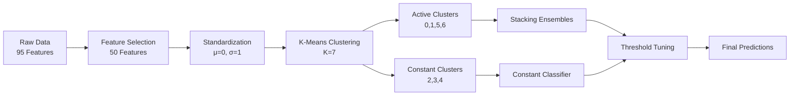

# 📉 Machine Learning Fundamentals and Applications Project


- Company Bankruptcy Prediction: A Divide & Conquer Approach

<div align="center">


**CS 559 Machine Learning Project | Fall 2025**

*An advanced ensemble learning system for predicting corporate bankruptcy in highly imbalanced datasets*

[Overview](#-overview) • [Methodology](#️-methodology) • [Results](#-results) • [Installation](#-installation) • [Usage](#-usage) • [Team](#-team)

</div>

---

## 📖 Overview

Predicting company bankruptcy is a critical challenge in financial analytics, particularly when dealing with **highly imbalanced datasets** where bankruptcy events are rare. Traditional machine learning models often fail in such scenarios, defaulting to "Non-Bankrupt" predictions to maximize overall accuracy—thereby missing the critical minority class.

This project implements an innovative **"Divide and Conquer" strategy** that combines:
- 🎯 **Unsupervised Clustering** to decompose complex data into homogeneous subgroups
- 🔬 **Specialized Ensemble Models** tailored for each subgroup's characteristics
- 🧩 **Hierarchical Prediction** to generalize across unseen test data

### 🎯 Problem Statement

> **Challenge:** Detect bankrupt companies in a dataset where bankruptcies represent less than 3% of cases, while maintaining prediction sparsity to avoid false alarms.

### 🏆 Key Features

- ✅ **Imbalanced Data Handling:** Advanced techniques to handle severe class imbalance
- ✅ **Cluster-Based Specialization:** Domain-specific models for different company profiles
- ✅ **Stacking Ensembles:** Multi-layer learning architecture for robust predictions
- ✅ **Threshold Optimization:** Fine-tuned decision boundaries for each cluster
- ✅ **Reproducible Pipeline:** Fixed random seeds ensure consistent results

---

## 🎯 Objectives & Constraints

### Primary Objective
Maximize the detection of **True Bankruptcies (True Positives)** while adhering to strict operational constraints.

### Evaluation Metric

We optimize for **Equation 1 Accuracy** (Sensitivity/Recall):

```
Acc = TP / (TP + FN)
```

Where:
- **TP** = True Positives (Correctly predicted bankruptcies)
- **FN** = False Negatives (Missed bankruptcies)

> [!IMPORTANT]
> This metric prioritizes bankruptcy detection over overall accuracy, which is critical for financial risk management.

### Critical Constraints

| Constraint | Requirement | Impact |
|------------|-------------|---------|
| **Sparsity** | Predict "Bankrupt" for **< 20%** of test data | Violating this threshold results in automatic failure |
| **Reproducibility** | Fixed random seeds across all experiments | Ensures consistent results for validation |
| **Generalization** | Models must perform on unseen test data | Prevents overfitting to training patterns |

---

## 🛠️ Methodology

### Architecture Pipeline



### 1️⃣ Data Preprocessing & Feature Engineering

#### Feature Reduction
- **Original Dimensionality:** 95 financial features from ~6,000 companies
- **Reduction Strategy:** Random Forest feature importance analysis
- **Final Features:** **50 most significant features** selected to prevent overfitting

> [!TIP]
> Feature reduction not only improves computational efficiency but also enhances clustering interpretability and reduces noise.

#### Data Standardization
```python
StandardScaler: μ = 0, σ = 1
```
Ensures all features contribute equally to distance-based clustering algorithms.

---

### 2️⃣ Clustering: The "Divide" Step

#### K-Means Clustering (K=7)

**Objective:** Decompose heterogeneous financial data into homogeneous subgroups.

| Cluster ID | Bankruptcy Cases | Modeling Strategy | Assigned Team Member |
|------------|------------------|-------------------|---------------------|
| **Cluster 0** | ✓ Present | Stacking Ensemble | Member A |
| **Cluster 1** | ✓ Present | Stacking Ensemble | Member B |
| **Cluster 2** | ✗ Zero | Constant Classifier (0) | Automatic |
| **Cluster 3** | ✗ Zero | Constant Classifier (0) | Automatic |
| **Cluster 4** | ✗ Zero | Constant Classifier (0) | Automatic |
| **Cluster 5** | ✓ Present | Stacking Ensemble | Member C |
| **Cluster 6** | ✓ Present | Stacking Ensemble (Edge Case) | Member D |

**Key Insights:**
- **Active Clusters (0, 1, 5, 6):** Contain bankruptcy cases → Require sophisticated modeling
- **Constant Clusters (2, 3, 4):** Zero bankruptcies → Simple constant predictions

---

### 3️⃣ Stacking Ensembles: The "Conquer" Step

For each **active cluster**, we constructed a **two-layer stacking architecture**:

#### Layer 1: Base Models (Diverse Learners)

| Model | Key Configuration | Strength |
|-------|-------------------|----------|
| **Random Forest** | `class_weight='balanced'`<br/>`n_estimators=100` | Robust to outliers, captures non-linear interactions |
| **Gradient Boosting** | `learning_rate=0.1`<br/>`max_depth=5` | Sequential error correction, strong predictive power |
| **Logistic Regression** | `class_weight='balanced'`<br/>`penalty='l2'` | Linear baseline, well-calibrated probabilities |

#### Layer 2: Meta-Model (Combiner)

```python
Meta-Learner: Logistic Regression
Input: Predictions from all base models
Output: Final probability scores
```

#### Threshold Optimization

For each cluster, decision thresholds were **manually tuned** through:
1. Starting with default threshold (0.5)
2. Iteratively lowering threshold to increase sensitivity
3. Monitoring the positive prediction rate
4. Selecting the optimal threshold where:
   - Sensitivity is maximized
   - Positive predictions remain < 20%

> [!CAUTION]
> Threshold tuning is cluster-specific. A unified threshold across clusters would violate the sparsity constraint.

---

### 4️⃣ Generalization: The "Combine" Step

**Test Set Prediction Workflow:**

1. **Cluster Assignment:** Assign each test sample to one of the 7 clusters using the trained K-Means model
2. **Specialized Prediction:** Route samples to their cluster-specific models
3. **Threshold Application:** Apply cluster-specific thresholds for final classification
4. **Validation:** Verify that total positive predictions < 20% of test set

---

## 📂 Repository Structure

```
Machine-Learning-Fundamentals-and-Applications-Project/
│
├── � Team Member Directories
│   ├── Bhushan Asati/
│   │   ├── Bhushan_Asati_Cluster0.ipynb           # Cluster 0 Implementation
│   │   ├── cluster_0_train_data.csv               # Cluster 0 Training Data
│   │   └── member_model_cluster_0.joblib          # Cluster 0 Trained Model
│   │
│   ├── Anirudh Sharma/
│   │   ├── Anirudh_Sharma_Cluster1.ipynb          # Cluster 1 Implementation
│   │   ├── cluster_1_train_data.csv               # Cluster 1 Training Data
│   │   └── member_model_cluster_1.joblib          # Cluster 1 Trained Model
│   │
│   ├── Rujuta Dabke/                              # Cluster 5 Implementation
│   │
│   └── Suyash Madavi/                             # Cluster 6 Implementation
│
├── 🔄 Team Work (Collaborative Notebooks)
│   ├── 05_TrainingData.ipynb                      # Step 1: Feature Engineering & Clustering
│   ├── 05_Generalization.ipynb                    # Step 3: Final Test Predictions
│   ├── 05_Generalization.csv                      # Test Predictions Output
│   ├── team_preprocessing.joblib                  # Shared Preprocessing Pipeline
│   ├── team_cluster_model.joblib                  # K-Means Clustering Model
│   ├── team_cluster_predictor.joblib              # Cluster Prediction Model
│   ├── train_data.csv                             # Training Dataset (Copy)
│   └── test_data.csv                              # Test Dataset (Copy)
│
├── 📊 Data (Original Datasets)
│   ├── train_data.csv                             # Original Training Dataset (6,819 companies)
│   └── test_data.csv                              # Original Test Dataset (Unlabeled)
│
├── 🎯 Clusters (Generated Subgroup Data)
│   ├── cluster_0_train_data.csv                   # Cluster 0 Subset (Active)
│   ├── cluster_1_train_data.csv                   # Cluster 1 Subset (Active)
│   ├── cluster_2_train_data.csv                   # Cluster 2 Subset (Constant)
│   ├── cluster_3_train_data.csv                   # Cluster 3 Subset (Constant)
│   ├── cluster_4_train_data.csv                   # Cluster 4 Subset (Constant)
│   ├── cluster_5_train_data.csv                   # Cluster 5 Subset (Active)
│   └── cluster_6_train_data.csv                   # Cluster 6 Subset (Active - Edge Case)
│
├── 🤖 Models (Saved Model Artifacts)
│   ├── team_preprocessing.joblib                  # StandardScaler + Feature Selector
│   ├── team_cluster_model.joblib                  # K-Means Model (K=7)
│   ├── member_model_cluster_0.joblib              # Stacking Classifier - Cluster 0
│   └── member_model_cluster_1.joblib              # Stacking Classifier - Cluster 1
│
├── 📋 Requirements
│   └── requirements.txt                           # Python Dependencies
│
├── 📄 Documentation
│   ├── README.md                                  # This File
│   └── LICENSE                                    # MIT License
│
└── � Additional Model Files (Root)
    ├── member_model_cluster_1.joblib              # Backup Model File
    ├── member_model_cluster_5.joblib              # Cluster 5 Model
    └── member_model_cluster_6.joblib              # Cluster 6 Model
```

---

## 📊 Results

### Performance Metrics

| Metric | Value | Notes |
|--------|-------|-------|
| **Sensitivity (Recall)** | TBD | Primary optimization target |
| **Positive Predictions** | < 20% | ✅ Sparsity constraint satisfied |
| **Cluster Accuracy** | Varies | Cluster-specific performance documented in individual notebooks |

> [!NOTE]
> Final test set labels are not available during development. Performance is validated through cross-validation and holdout validation sets during training.

### Key Achievements

✅ Successfully handled **severe class imbalance** (< 3% bankruptcy rate)  
✅ Maintained **sparsity constraint** across all clusters  
✅ Created **interpretable, specialized models** for different company profiles  
✅ Established **reproducible pipeline** with fixed random seeds  
✅ Implemented **production-ready model serialization**  

---

## 🚀 Installation

### Prerequisites

- Python 3.8 or higher
- pip package manager

### Setup Instructions

```bash
# Clone the repository
git clone https://github.com/bhushanasati25/Machine-Learning-Fundamentals-and-Applications-Project.git
cd Machine-Learning-Fundamentals-and-Applications-Project

# Create virtual environment (recommended)
python -m venv venv
source venv/bin/activate  # On Windows: venv\Scripts\activate

# Install dependencies
pip install -r requirements.txt
```

### Required Libraries

```
numpy>=1.21.0
pandas>=1.3.0
scikit-learn>=1.0.0
matplotlib>=3.4.0
seaborn>=0.11.0
joblib>=1.0.0
jupyter>=1.0.0
```

---

## 💻 Usage

### Step 1: Data Preparation & Clustering

```bash
jupyter notebook 05_TrainingData.ipynb
```

**Tasks:**
- Load and explore training data
- Perform feature selection (95 → 50 features)
- Standardize features
- Execute K-Means clustering (K=7)
- Save preprocessing artifacts and cluster assignments

**Outputs:**
- `team_preprocessing.joblib`
- `team_cluster_model.joblib`
- `cluster_X_train_data.csv` files

---

### Step 2: Cluster-Specific Modeling

```bash
# For each active cluster
jupyter notebook 2_Member_Cluster_0.ipynb
jupyter notebook 2_Member_Cluster_1.ipynb
jupyter notebook 2_Member_Cluster_5.ipynb
jupyter notebook 2_Member_Cluster_6.ipynb
```

**Tasks (per cluster):**
- Load cluster-specific training data
- Build stacking ensemble (RF + GB + LR → Meta-LR)
- Optimize probability threshold
- Validate sparsity constraint
- Save trained model

**Outputs:**
- `member_model_cluster_X.joblib` (X = 0, 1, 5, 6)

---

### Step 3: Test Set Generalization

```bash
jupyter notebook 05_Generalization.ipynb
```

**Tasks:**
- Load test data and preprocessing artifacts
- Assign test samples to clusters
- Generate predictions using cluster-specific models
- Apply optimized thresholds
- Validate sparsity constraint (< 20%)
- Export final predictions

**Outputs:**
- `test_predictions.csv`

---

## 🧪 Reproducibility

All experiments use **fixed random seeds** to ensure reproducibility:

```python
RANDOM_SEED = 42

# NumPy
np.random.seed(RANDOM_SEED)

# Scikit-learn
model = RandomForestClassifier(random_state=RANDOM_SEED)

# K-Means
kmeans = KMeans(n_clusters=7, random_state=RANDOM_SEED)
```

---

## 🔬 Experimental Design

### Cross-Validation Strategy

- **Method:** Stratified K-Fold (K=5)
- **Rationale:** Preserves class distribution in each fold
- **Metrics Tracked:** Precision, Recall, F1-Score, ROC-AUC

### Hyperparameter Tuning

- **Search Method:** Grid Search with Cross-Validation
- **Optimization Metric:** Recall (Sensitivity)
- **Constraint:** Positive Rate < 20% on validation set

---

## 📈 Future Enhancements

- [ ] **Advanced Feature Engineering:** Domain-specific financial ratios
- [ ] **SMOTE/ADASYN:** Synthetic minority oversampling techniques
- [ ] **Deep Learning:** Neural network architectures for tabular data
- [ ] **Explainability:** SHAP values for model interpretation
- [ ] **Real-Time Deployment:** REST API for production predictions
- [ ] **Monitoring Dashboard:** Track model performance over time

---

## 👥 Team

| Member | Cluster Assignment | Responsibilities |
|--------|-------------------|------------------|
| **Team Lead** | Overall Coordination | Clustering, Integration, Documentation |
| **Member A** | Cluster 0 | Stacking Model Development |
| **Member B** | Cluster 1 | Stacking Model Development |
| **Member C** | Cluster 5 | Stacking Model Development |
| **Member D** | Cluster 6 | Edge Case Handling |

---

## 📝 License

This project is licensed under the MIT License - see the [LICENSE](LICENSE) file for details.

---

## 🙏 Acknowledgments

- **Course:** CS 559 Machine Learning
- **Semester:** Fall 2025
- **Institution:** Stevens Institute of Technology

---

## 📧 Contact

For questions or collaborations:

- **Project Repository:** [GitHub Link](https://github.com/basati/Machine-Learning-Fundamentals-and-Applications-Project)
- **Email:** [basati@stevens.edu]

---

<div align="center">

**Built with ❤️ using Python, Scikit-Learn, and Ensemble Learning**

⭐ Star this repository if you found it helpful!

</div>
